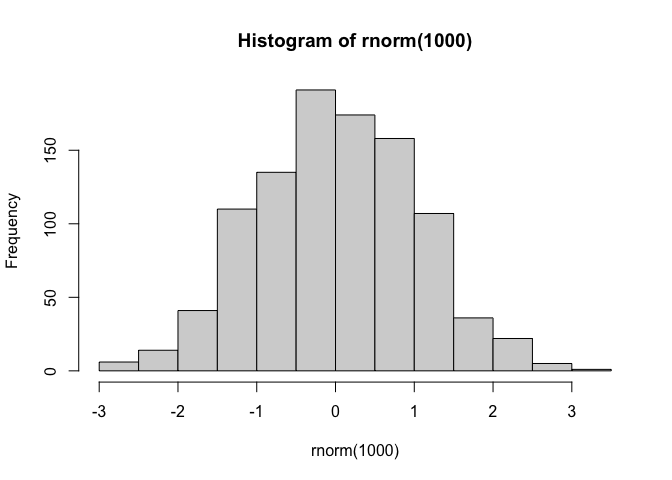
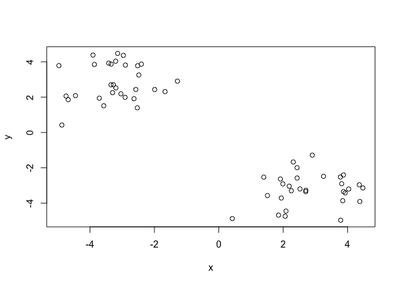
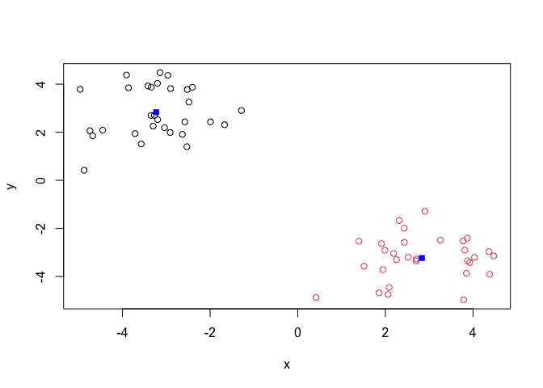
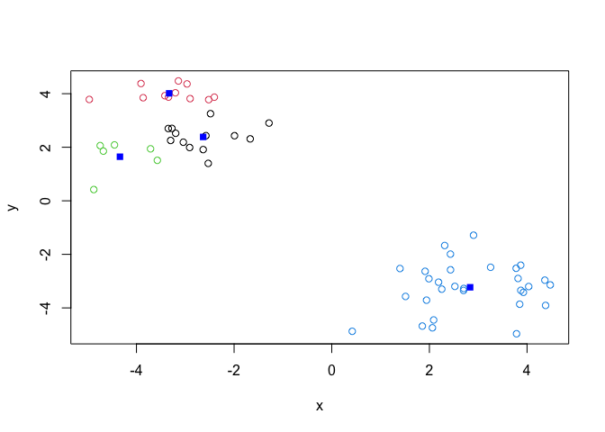
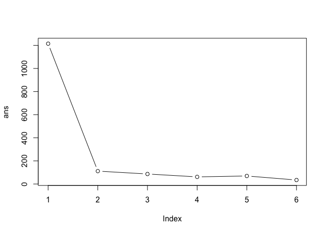
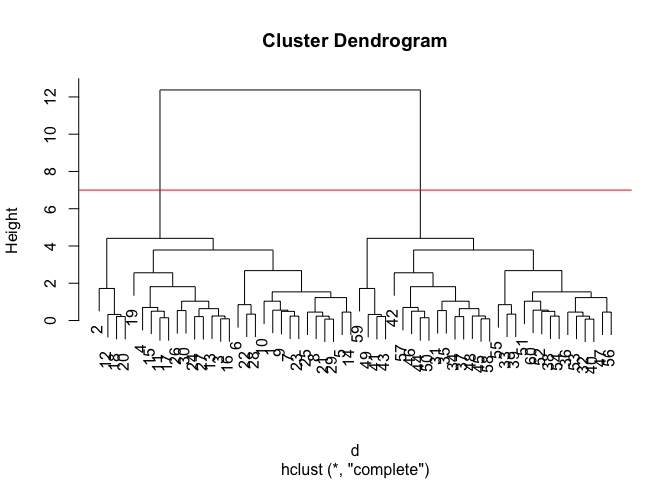
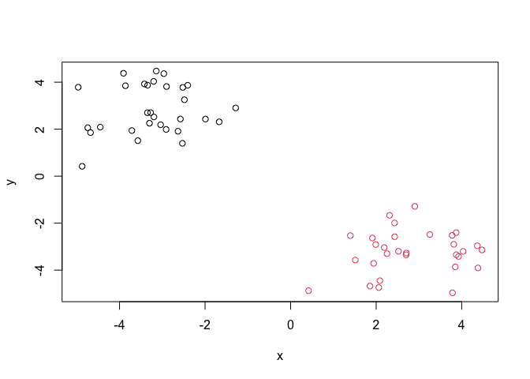
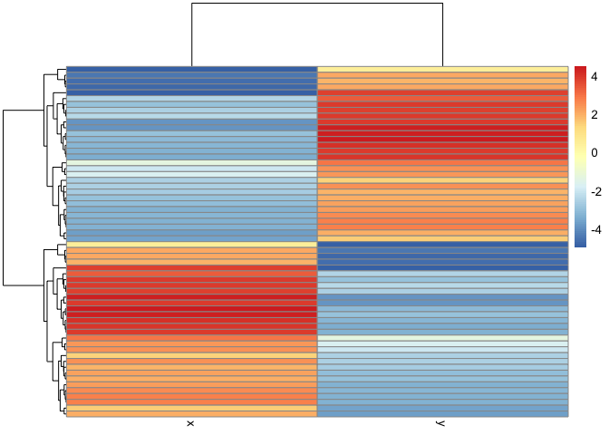
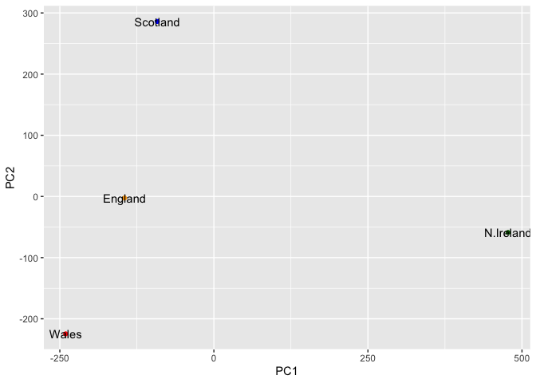

# Class 7: Machine Learning 1
Barry (PID: 911)

Today we will begin our exploration of some “classical” machine leanring
appraches. We will start with clustering:

Let’s first make up some data to cluster where we know what thw answer
should be.

``` r
hist( rnorm(1000) )
```



``` r
x <- c( rnorm(30, mean=-3), rnorm(30, mean=3) )
y <- rev(x)

x <- cbind(x, y)
head(x)
```

                 x        y
    [1,] -2.576945 2.432837
    [2,] -4.873779 0.419568
    [3,] -3.344292 3.872036
    [4,] -2.483003 3.253693
    [5,] -3.711204 1.941073
    [6,] -1.285050 2.903757

A wee peak at x with `plot()`

``` r
plot(x)
```



Then main function in “base” R for K-means clustering is called
`kmeans()`.

``` r
k <- kmeans(x, centers = 2)
k
```

    K-means clustering with 2 clusters of sizes 30, 30

    Cluster means:
              x         y
    1 -3.229869  2.834093
    2  2.834093 -3.229869

    Clustering vector:
     [1] 1 1 1 1 1 1 1 1 1 1 1 1 1 1 1 1 1 1 1 1 1 1 1 1 1 1 1 1 1 1 2 2 2 2 2 2 2 2
    [39] 2 2 2 2 2 2 2 2 2 2 2 2 2 2 2 2 2 2 2 2 2 2

    Within cluster sum of squares by cluster:
    [1] 55.72892 55.72892
     (between_SS / total_SS =  90.8 %)

    Available components:

    [1] "cluster"      "centers"      "totss"        "withinss"     "tot.withinss"
    [6] "betweenss"    "size"         "iter"         "ifault"      

> Q. How big are the clusters (i.e their size)?

``` r
k$size
```

    [1] 30 30

> Q. What clusters do my data points reside in?

``` r
k$cluster
```

     [1] 1 1 1 1 1 1 1 1 1 1 1 1 1 1 1 1 1 1 1 1 1 1 1 1 1 1 1 1 1 1 2 2 2 2 2 2 2 2
    [39] 2 2 2 2 2 2 2 2 2 2 2 2 2 2 2 2 2 2 2 2 2 2

> Q. Make a plot of our data colored by cluster assignment - i.e. Make a
> result figure…

``` r
plot(x, col=k$cluster )
points(k$centers, col="blue", pch=15)
```



> Q. Cluster with k-means into 4 clusters and plot your results as
> above.

``` r
k4 <- kmeans(x, centers = 4)

plot(x, col=k4$cluster )
points(k4$centers, col="blue", pch=15)
```



> Q. Run kmeans with centers (i.e. values of k) equal 1 to 6

``` r
k1 <- kmeans(x, centers=1)$tot.withinss
k2 <- kmeans(x, centers=2)$tot.withinss
k3 <- kmeans(x, centers=3)$tot.withinss
k4 <- kmeans(x, centers=4)$tot.withinss
k5 <- kmeans(x, centers=5)$tot.withinss
k6 <- kmeans(x, centers=6)$tot.withinss

ans <- c(k1, k2, k3, k4, k5, k6)
```

Or use a for loop

``` r
ans <- NULL
for(i in 1:6) {
  ans <- c(ans, kmeans(x, centers=i)$tot.withinss)
}
ans
```

    [1] 1214.60681  111.45783   86.51602   61.57421   69.41121   34.46987

Make a “scree-plot”

``` r
plot(ans, typ="b")
```



## Hierarchical Clustering

The main function in “base” R for this is called `hclust()`

``` r
d <- dist(x)
hc <- hclust(d)
hc
```


    Call:
    hclust(d = d)

    Cluster method   : complete 
    Distance         : euclidean 
    Number of objects: 60 

``` r
plot(hc)
abline(h=7, col="red")
```



To obtain clusters from our `hclust` result object **hc** we “cut” the
tree to yield different sub branches. For this we use the `cutree()`
function

``` r
grps <- cutree(hc, h=7)
grps
```

     [1] 1 1 1 1 1 1 1 1 1 1 1 1 1 1 1 1 1 1 1 1 1 1 1 1 1 1 1 1 1 1 2 2 2 2 2 2 2 2
    [39] 2 2 2 2 2 2 2 2 2 2 2 2 2 2 2 2 2 2 2 2 2 2

Results figure

``` r
plot(x, col=grps)
```



``` r
library(pheatmap)

pheatmap(x)
```



## Principal Component Analysis (PCA)

``` r
url <- "https://tinyurl.com/UK-foods"
x <- read.csv(url)
```

> Q1. How many rows and columns are in your new data frame named x? What
> R functions could you use to answer this questions?

``` r
dim(x)
```

    [1] 17  5

``` r
head(x)
```

                   X England Wales Scotland N.Ireland
    1         Cheese     105   103      103        66
    2  Carcass_meat      245   227      242       267
    3    Other_meat      685   803      750       586
    4           Fish     147   160      122        93
    5 Fats_and_oils      193   235      184       209
    6         Sugars     156   175      147       139

``` r
rownames(x) <- x[,1]
x <- x[,-1]
head(x)
```

                   England Wales Scotland N.Ireland
    Cheese             105   103      103        66
    Carcass_meat       245   227      242       267
    Other_meat         685   803      750       586
    Fish               147   160      122        93
    Fats_and_oils      193   235      184       209
    Sugars             156   175      147       139

``` r
x <- read.csv(url, row.names = 1)
head(x)
```

                   England Wales Scotland N.Ireland
    Cheese             105   103      103        66
    Carcass_meat       245   227      242       267
    Other_meat         685   803      750       586
    Fish               147   160      122        93
    Fats_and_oils      193   235      184       209
    Sugars             156   175      147       139

> Q2. Which approach to solving the ‘row-names problem’ mentioned above
> do you prefer and why? Is one approach more robust than another under
> certain circumstances?

I like fixing it up front when reading the data…

### Spotting major differences and trends

``` r
rainbow(nrow(x))
```

     [1] "#FF0000" "#FF5A00" "#FFB400" "#F0FF00" "#96FF00" "#3CFF00" "#00FF1E"
     [8] "#00FF78" "#00FFD2" "#00D2FF" "#0078FF" "#001EFF" "#3C00FF" "#9600FF"
    [15] "#F000FF" "#FF00B4" "#FF005A"

``` r
barplot(as.matrix(x), beside=T, col=rainbow(nrow(x)))
```


``` r
barplot(as.matrix(x), col=rainbow(nrow(x)))
```


## Pairs plots and heatmaps

Scatterplot matrices (a.k.a. “pairs plots”) can be useful for relatively
small datasets like this one. Let’s have a look:

``` r
pairs(x, col=rainbow(nrow(x)), pch=16)
```


``` r
library(pheatmap)

pheatmap( as.matrix(x) )
```


> Q6. Based on the pairs and heatmap figures, which countries cluster
> together and what does this suggest about their food consumption
> patterns? Can you easily tell what the main differences between N.
> Ireland and the other countries of the UK in terms of this data-set?

It looks like Wales and England are quite similar in their consumption
of these foods. It is still quite dificult to tell what is going on in
the dataset.

## PCA to the rescue

The main function in “base” R for PCA is called `prcomp()`.

As we want to do PCA on the food data for the different countires we
will want the foods in the columns.

``` r
pca <- prcomp( t(x) )
summary(pca)
```

    Importance of components:
                                PC1      PC2      PC3       PC4
    Standard deviation     324.1502 212.7478 73.87622 2.921e-14
    Proportion of Variance   0.6744   0.2905  0.03503 0.000e+00
    Cumulative Proportion    0.6744   0.9650  1.00000 1.000e+00

Our result object is called `pca` and it has a `$x` component that we
will look at first

``` r
pca$x
```

                     PC1         PC2        PC3           PC4
    England   -144.99315   -2.532999 105.768945 -9.152022e-15
    Wales     -240.52915 -224.646925 -56.475555  5.560040e-13
    Scotland   -91.86934  286.081786 -44.415495 -6.638419e-13
    N.Ireland  477.39164  -58.901862  -4.877895  1.329771e-13

``` r
library(ggplot2)

cols <- c("orange", "red", "blue", "darkgreen")

ggplot(pca$x) +
  aes(PC1, PC2, label=rownames(pca$x)) +
  geom_point(col=cols) +
  geom_text()
```



Another major result out of PCA is the so-called “variable loadings” or
`$rotation` that tells us how the origional variables (foods) contribute
to PCs (i.e. our new axis).

``` r
ggplot(pca$rotation) +
  aes(PC1, rownames(pca$rotation)) +
  geom_col()
```


