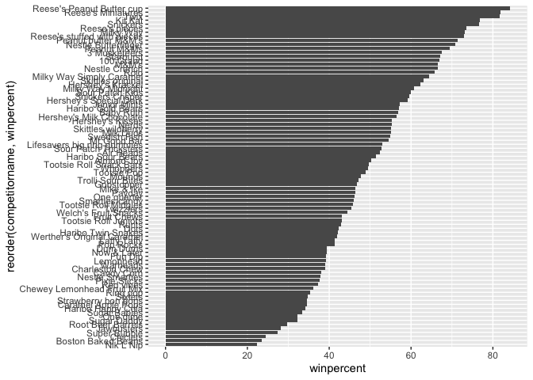
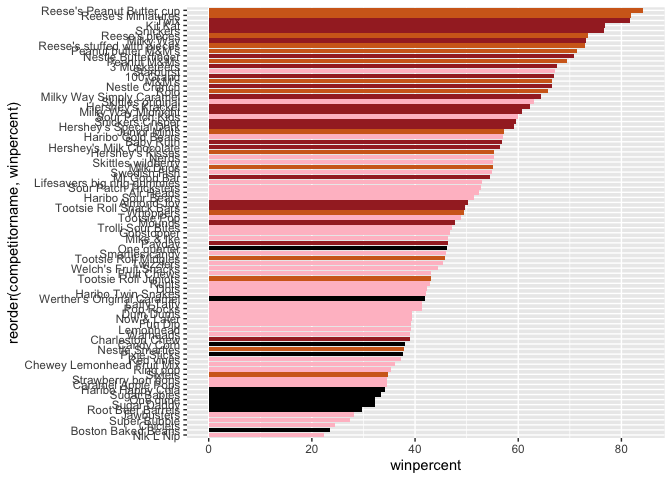
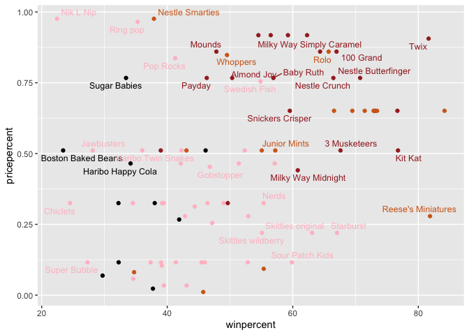
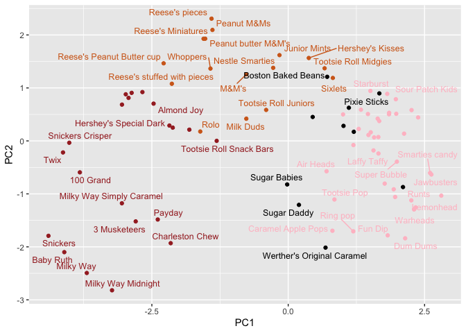
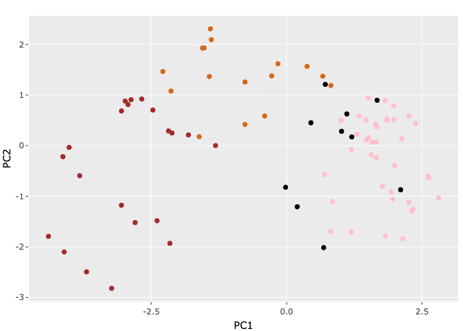

# candy


``` r
library(readr)

candy_file <- "candy-data.csv"
#candy <- read_csv(candy_file)
candy <- read.csv(candy_file)
head(candy)
```

      competitorname chocolate fruity caramel peanutyalmondy nougat
    1      100 Grand         1      0       1              0      0
    2   3 Musketeers         1      0       0              0      1
    3       One dime         0      0       0              0      0
    4    One quarter         0      0       0              0      0
    5      Air Heads         0      1       0              0      0
    6     Almond Joy         1      0       0              1      0
      crispedricewafer hard bar pluribus sugarpercent pricepercent winpercent
    1                1    0   1        0        0.732        0.860   66.97173
    2                0    0   1        0        0.604        0.511   67.60294
    3                0    0   0        0        0.011        0.116   32.26109
    4                0    0   0        0        0.011        0.511   46.11650
    5                0    0   0        0        0.906        0.511   52.34146
    6                0    0   1        0        0.465        0.767   50.34755

``` r
library(flextable)

candy |>
  head(10) |>
  flextable()
```


``` r
library(dplyr)
```


    Attaching package: 'dplyr'

    The following objects are masked from 'package:stats':

        filter, lag

    The following objects are masked from 'package:base':

        intersect, setdiff, setequal, union

``` r
candy |> 
  filter(competitorname=="Twix") |>
  select(winpercent)
```

      winpercent
    1   81.64291

``` r
#candy["Twix", ]$winpercent
```

``` r
library("skimr")
skim(candy)
```

|                                                  |       |
|:-------------------------------------------------|:------|
| Name                                             | candy |
| Number of rows                                   | 85    |
| Number of columns                                | 13    |
| \_\_\_\_\_\_\_\_\_\_\_\_\_\_\_\_\_\_\_\_\_\_\_   |       |
| Column type frequency:                           |       |
| character                                        | 1     |
| numeric                                          | 12    |
| \_\_\_\_\_\_\_\_\_\_\_\_\_\_\_\_\_\_\_\_\_\_\_\_ |       |
| Group variables                                  | None  |

Data summary

**Variable type: character**

| skim_variable  | n_missing | complete_rate | min | max | empty | n_unique | whitespace |
|:---------------|----------:|--------------:|----:|----:|------:|---------:|-----------:|
| competitorname |         0 |             1 |   4 |  27 |     0 |       85 |          0 |

**Variable type: numeric**

| skim_variable | n_missing | complete_rate | mean | sd | p0 | p25 | p50 | p75 | p100 | hist |
|:---|---:|---:|---:|---:|---:|---:|---:|---:|---:|:---|
| chocolate | 0 | 1 | 0.44 | 0.50 | 0.00 | 0.00 | 0.00 | 1.00 | 1.00 | ▇▁▁▁▆ |
| fruity | 0 | 1 | 0.45 | 0.50 | 0.00 | 0.00 | 0.00 | 1.00 | 1.00 | ▇▁▁▁▆ |
| caramel | 0 | 1 | 0.16 | 0.37 | 0.00 | 0.00 | 0.00 | 0.00 | 1.00 | ▇▁▁▁▂ |
| peanutyalmondy | 0 | 1 | 0.16 | 0.37 | 0.00 | 0.00 | 0.00 | 0.00 | 1.00 | ▇▁▁▁▂ |
| nougat | 0 | 1 | 0.08 | 0.28 | 0.00 | 0.00 | 0.00 | 0.00 | 1.00 | ▇▁▁▁▁ |
| crispedricewafer | 0 | 1 | 0.08 | 0.28 | 0.00 | 0.00 | 0.00 | 0.00 | 1.00 | ▇▁▁▁▁ |
| hard | 0 | 1 | 0.18 | 0.38 | 0.00 | 0.00 | 0.00 | 0.00 | 1.00 | ▇▁▁▁▂ |
| bar | 0 | 1 | 0.25 | 0.43 | 0.00 | 0.00 | 0.00 | 0.00 | 1.00 | ▇▁▁▁▂ |
| pluribus | 0 | 1 | 0.52 | 0.50 | 0.00 | 0.00 | 1.00 | 1.00 | 1.00 | ▇▁▁▁▇ |
| sugarpercent | 0 | 1 | 0.48 | 0.28 | 0.01 | 0.22 | 0.47 | 0.73 | 0.99 | ▇▇▇▇▆ |
| pricepercent | 0 | 1 | 0.47 | 0.29 | 0.01 | 0.26 | 0.47 | 0.65 | 0.98 | ▇▇▇▇▆ |
| winpercent | 0 | 1 | 50.32 | 14.71 | 22.45 | 39.14 | 47.83 | 59.86 | 84.18 | ▃▇▆▅▂ |

## Plot a histogram of winpercent values

``` r
library(ggplot2)

ggplot(candy) +
  aes(winpercent) +
  geom_histogram(bins=20) 
```


``` r
ggplot(candy) +
  aes(winpercent)+
  geom_density()
```


``` r
candy |>
  filter(chocolate==1) |>
  select(winpercent) -> win.choc

candy |>
  filter(fruity==1) |>
  select(winpercent) -> win.fruit
```

``` r
summary(win.choc)
```

       winpercent   
     Min.   :34.72  
     1st Qu.:50.35  
     Median :60.80  
     Mean   :60.92  
     3rd Qu.:70.74  
     Max.   :84.18  

``` r
summary(win.fruit)
```

       winpercent   
     Min.   :22.45  
     1st Qu.:39.04  
     Median :42.97  
     Mean   :44.12  
     3rd Qu.:52.11  
     Max.   :67.04  

``` r
t.test(win.choc, win.fruit)
```


        Welch Two Sample t-test

    data:  win.choc and win.fruit
    t = 6.2582, df = 68.882, p-value = 2.871e-08
    alternative hypothesis: true difference in means is not equal to 0
    95 percent confidence interval:
     11.44563 22.15795
    sample estimates:
    mean of x mean of y 
     60.92153  44.11974 

``` r
ggplot(candy) + 
  aes(winpercent, reorder(competitorname, winpercent)) +
  geom_col()
```



``` r
my_cols=rep("black", nrow(candy))
my_cols[as.logical(candy$chocolate)] = "chocolate"
my_cols[as.logical(candy$bar)] = "brown"
my_cols[as.logical(candy$fruity)] = "pink"
```

``` r
ggplot(candy) + 
  aes(winpercent, reorder(competitorname, winpercent)) +
  geom_col(fill=my_cols)
```



``` r
library(ggrepel)

ggplot(candy) +
  aes(winpercent, pricepercent, label=competitorname) +
  geom_point(col=my_cols) + 
  geom_text_repel(col=my_cols, size=3.3, max.overlaps = 5)
```

    Warning: ggrepel: 50 unlabeled data points (too many overlaps). Consider
    increasing max.overlaps



``` r
library(corrplot)
```

    corrplot 0.95 loaded

``` r
cij <- cor(candy[,-1])
corrplot(cij)
```


``` r
pca <- prcomp(candy[,-1], scale=T)
summary(pca)
```

    Importance of components:
                              PC1    PC2    PC3     PC4    PC5     PC6     PC7
    Standard deviation     2.0788 1.1378 1.1092 1.07533 0.9518 0.81923 0.81530
    Proportion of Variance 0.3601 0.1079 0.1025 0.09636 0.0755 0.05593 0.05539
    Cumulative Proportion  0.3601 0.4680 0.5705 0.66688 0.7424 0.79830 0.85369
                               PC8     PC9    PC10    PC11    PC12
    Standard deviation     0.74530 0.67824 0.62349 0.43974 0.39760
    Proportion of Variance 0.04629 0.03833 0.03239 0.01611 0.01317
    Cumulative Proportion  0.89998 0.93832 0.97071 0.98683 1.00000

``` r
p <- ggplot(pca$x) +
  aes(PC1, PC2, label=candy$competitorname) +
  geom_point(col=my_cols) 

p + geom_text_repel(size=3.3, col=my_cols, max.overlaps = 7)
```

    Warning: ggrepel: 35 unlabeled data points (too many overlaps). Consider
    increasing max.overlaps



``` r
library(plotly)
```


    Attaching package: 'plotly'

    The following object is masked from 'package:ggplot2':

        last_plot

    The following objects are masked from 'package:flextable':

        highlight, style

    The following object is masked from 'package:stats':

        filter

    The following object is masked from 'package:graphics':

        layout

``` r
ggplotly(p)
```

    file:////private/var/folders/jd/wjwf0lcj0kd0tch_70sd1l4w0000gn/T/RtmpwBp0i8/file16a236994f0db/widget16a233150f004.html screenshot completed



``` r
#pca$rotation

ggplot(pca$rotation) +
  aes(PC1, rownames(pca$rotation)) +
  geom_col()
```


