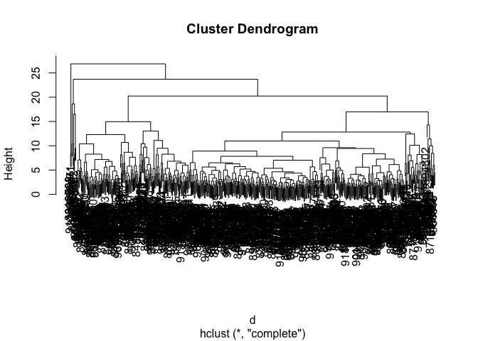
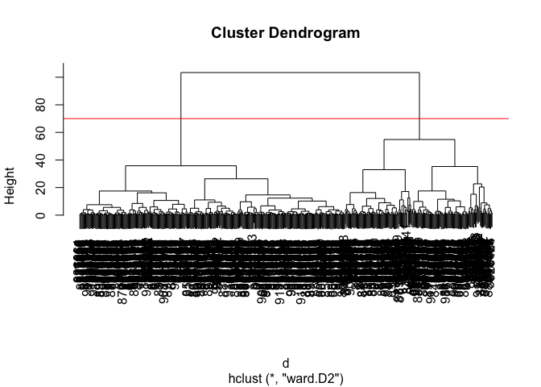

# Class 08: Breast Cancer Analysis Project
Barry (PID: 911)

- [Background](#background)
- [Data import](#data-import)
- [Exploratory data analysis](#exploratory-data-analysis)
- [Principal Component Analysis](#principal-component-analysis)
- [Hierarchical clustering](#hierarchical-clustering)
- [Combining PCA and clustering](#combining-pca-and-clustering)

## Background

The goal of todays mini-project is to explore a complete analysis using
the unsupervised learning techniques covered in the last class. We will
extend what we learned by combining PCA as a preprocessing step to
clustering using data that consist of measurements of cell nuclei of
human breast masses.

The data itself comes from the Wisconsin Breast Cancer Diagnostic Data
Set first reported by K. P. Benne and O. L. Mangasarian: “Robust Linear
Programming Discrimination of Two Linearly Inseparable Sets”.

Values in this data set describe characteristics of the cell nuclei
present in digitized images of a fine needle aspiration (FNA) of a
breast mass.

## Data import

The data is available as a CSV from the class website:

``` r
wisc.df <- read.csv("WisconsinCancer.csv", row.names = 1)
```

Make sure we do not include sample id or diagnosis columns in the data
that we analyze below.

``` r
diagnosis <- as.factor(wisc.df$diagnosis)
wisc.data <- wisc.df[, -1]
dim(wisc.data)
```

    [1] 569  30

``` r
head(wisc.data)
```

             radius_mean texture_mean perimeter_mean area_mean smoothness_mean
    842302         17.99        10.38         122.80    1001.0         0.11840
    842517         20.57        17.77         132.90    1326.0         0.08474
    84300903       19.69        21.25         130.00    1203.0         0.10960
    84348301       11.42        20.38          77.58     386.1         0.14250
    84358402       20.29        14.34         135.10    1297.0         0.10030
    843786         12.45        15.70          82.57     477.1         0.12780
             compactness_mean concavity_mean concave.points_mean symmetry_mean
    842302            0.27760         0.3001             0.14710        0.2419
    842517            0.07864         0.0869             0.07017        0.1812
    84300903          0.15990         0.1974             0.12790        0.2069
    84348301          0.28390         0.2414             0.10520        0.2597
    84358402          0.13280         0.1980             0.10430        0.1809
    843786            0.17000         0.1578             0.08089        0.2087
             fractal_dimension_mean radius_se texture_se perimeter_se area_se
    842302                  0.07871    1.0950     0.9053        8.589  153.40
    842517                  0.05667    0.5435     0.7339        3.398   74.08
    84300903                0.05999    0.7456     0.7869        4.585   94.03
    84348301                0.09744    0.4956     1.1560        3.445   27.23
    84358402                0.05883    0.7572     0.7813        5.438   94.44
    843786                  0.07613    0.3345     0.8902        2.217   27.19
             smoothness_se compactness_se concavity_se concave.points_se
    842302        0.006399        0.04904      0.05373           0.01587
    842517        0.005225        0.01308      0.01860           0.01340
    84300903      0.006150        0.04006      0.03832           0.02058
    84348301      0.009110        0.07458      0.05661           0.01867
    84358402      0.011490        0.02461      0.05688           0.01885
    843786        0.007510        0.03345      0.03672           0.01137
             symmetry_se fractal_dimension_se radius_worst texture_worst
    842302       0.03003             0.006193        25.38         17.33
    842517       0.01389             0.003532        24.99         23.41
    84300903     0.02250             0.004571        23.57         25.53
    84348301     0.05963             0.009208        14.91         26.50
    84358402     0.01756             0.005115        22.54         16.67
    843786       0.02165             0.005082        15.47         23.75
             perimeter_worst area_worst smoothness_worst compactness_worst
    842302            184.60     2019.0           0.1622            0.6656
    842517            158.80     1956.0           0.1238            0.1866
    84300903          152.50     1709.0           0.1444            0.4245
    84348301           98.87      567.7           0.2098            0.8663
    84358402          152.20     1575.0           0.1374            0.2050
    843786            103.40      741.6           0.1791            0.5249
             concavity_worst concave.points_worst symmetry_worst
    842302            0.7119               0.2654         0.4601
    842517            0.2416               0.1860         0.2750
    84300903          0.4504               0.2430         0.3613
    84348301          0.6869               0.2575         0.6638
    84358402          0.4000               0.1625         0.2364
    843786            0.5355               0.1741         0.3985
             fractal_dimension_worst
    842302                   0.11890
    842517                   0.08902
    84300903                 0.08758
    84348301                 0.17300
    84358402                 0.07678
    843786                   0.12440

## Exploratory data analysis

> Q1. How many observations are in this dataset?

There are 569 observations/samples/patients in the data set.

> Q2. How many of the observations have a malignant diagnosis?

``` r
sum(wisc.df$diagnosis == "M")
```

    [1] 212

``` r
table(wisc.df$diagnosis)
```


      B   M 
    357 212 

> Q3. How many variables/features in the data are suffixed with \_mean?

``` r
#colnames(wisc.data)
length( grep("_mean", colnames(wisc.data)) )
```

    [1] 10

``` r
n <- colnames(wisc.data)
inds <- grep("_mean", n)
length(inds)
```

    [1] 10

## Principal Component Analysis

The main function in base R for PCA is called `prcomp()`. A optional
argument `scale` should nearly always be switched to `scale=TRUE` for
this function.

``` r
wisc.pr <- prcomp(wisc.data, scale=TRUE)
summary(wisc.pr)
```

    Importance of components:
                              PC1    PC2     PC3     PC4     PC5     PC6     PC7
    Standard deviation     3.6444 2.3857 1.67867 1.40735 1.28403 1.09880 0.82172
    Proportion of Variance 0.4427 0.1897 0.09393 0.06602 0.05496 0.04025 0.02251
    Cumulative Proportion  0.4427 0.6324 0.72636 0.79239 0.84734 0.88759 0.91010
                               PC8    PC9    PC10   PC11    PC12    PC13    PC14
    Standard deviation     0.69037 0.6457 0.59219 0.5421 0.51104 0.49128 0.39624
    Proportion of Variance 0.01589 0.0139 0.01169 0.0098 0.00871 0.00805 0.00523
    Cumulative Proportion  0.92598 0.9399 0.95157 0.9614 0.97007 0.97812 0.98335
                              PC15    PC16    PC17    PC18    PC19    PC20   PC21
    Standard deviation     0.30681 0.28260 0.24372 0.22939 0.22244 0.17652 0.1731
    Proportion of Variance 0.00314 0.00266 0.00198 0.00175 0.00165 0.00104 0.0010
    Cumulative Proportion  0.98649 0.98915 0.99113 0.99288 0.99453 0.99557 0.9966
                              PC22    PC23   PC24    PC25    PC26    PC27    PC28
    Standard deviation     0.16565 0.15602 0.1344 0.12442 0.09043 0.08307 0.03987
    Proportion of Variance 0.00091 0.00081 0.0006 0.00052 0.00027 0.00023 0.00005
    Cumulative Proportion  0.99749 0.99830 0.9989 0.99942 0.99969 0.99992 0.99997
                              PC29    PC30
    Standard deviation     0.02736 0.01153
    Proportion of Variance 0.00002 0.00000
    Cumulative Proportion  1.00000 1.00000

Let’s make our main result figure - the “PC plot” or “score plot”,
“ordienation plot”…

``` r
library(ggplot2)

ggplot(wisc.pr$x) +
  aes(PC1, PC2, col=diagnosis) +
  geom_point()
```


> Q4. From your results, what proportion of the original variance is
> captured by the first principal components (PC1)?

``` r
pr.var <- wisc.pr$sdev^2
pr.var / sum(pr.var) 
```

     [1] 4.427203e-01 1.897118e-01 9.393163e-02 6.602135e-02 5.495768e-02
     [6] 4.024522e-02 2.250734e-02 1.588724e-02 1.389649e-02 1.168978e-02
    [11] 9.797190e-03 8.705379e-03 8.045250e-03 5.233657e-03 3.137832e-03
    [16] 2.662093e-03 1.979968e-03 1.753959e-03 1.649253e-03 1.038647e-03
    [21] 9.990965e-04 9.146468e-04 8.113613e-04 6.018336e-04 5.160424e-04
    [26] 2.725880e-04 2.300155e-04 5.297793e-05 2.496010e-05 4.434827e-06

> Q5. How many principal components (PCs) are required to describe at
> least 70% of the original variance in the data?

> Q6. How many principal components (PCs) are required to describe at
> least 90% of the original variance in the data?

## Hierarchical clustering

``` r
apply(scale(wisc.data), 2, sd)
```

                radius_mean            texture_mean          perimeter_mean 
                          1                       1                       1 
                  area_mean         smoothness_mean        compactness_mean 
                          1                       1                       1 
             concavity_mean     concave.points_mean           symmetry_mean 
                          1                       1                       1 
     fractal_dimension_mean               radius_se              texture_se 
                          1                       1                       1 
               perimeter_se                 area_se           smoothness_se 
                          1                       1                       1 
             compactness_se            concavity_se       concave.points_se 
                          1                       1                       1 
                symmetry_se    fractal_dimension_se            radius_worst 
                          1                       1                       1 
              texture_worst         perimeter_worst              area_worst 
                          1                       1                       1 
           smoothness_worst       compactness_worst         concavity_worst 
                          1                       1                       1 
       concave.points_worst          symmetry_worst fractal_dimension_worst 
                          1                       1                       1 

``` r
d <- dist(scale(wisc.data))
h <- hclust(d)
plot(h)
```



# Combining PCA and clustering

``` r
d <- dist( wisc.pr$x[,1:3] )
wisc.pr.hclust <- hclust(d, method="ward.D2")
plot(wisc.pr.hclust)
abline(h=70, col="red")
```



Get my cluster membership vector

``` r
grps <- cutree(wisc.pr.hclust, h=70)
table(grps)
```

    grps
      1   2 
    203 366 

``` r
table(diagnosis)
```

    diagnosis
      B   M 
    357 212 

Make a wee “cross-table”

``` r
table(grps, diagnosis)
```

        diagnosis
    grps   B   M
       1  24 179
       2 333  33

TP: 179 FP: 24

Sensitivity: TP/(TP+FN)
