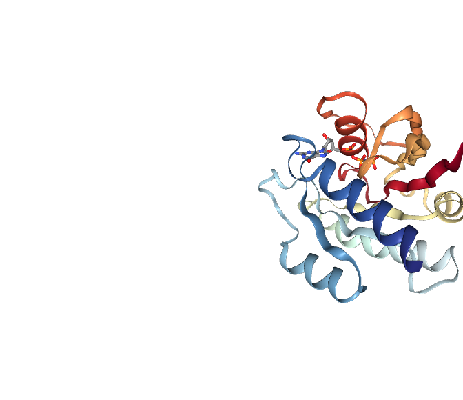

# Test conditional output


``` r
library(bio3d)
library(bio3dview)

p <- read.pdb("5p21")
```

      Note: Accessing on-line PDB file

An alternative way:

``` r
display3d <- function(data, ...) {
  if(knitr::is_latex_output()) {
    message("3D molecular visualization available in HTML version")
  } else {
    view.pdb(data, ...)
  }
}
```

``` r
display3d(p)
```

    file:////private/var/folders/jd/wjwf0lcj0kd0tch_70sd1l4w0000gn/T/RtmpSmedFF/file16a585d3a2ff1/widget16a581721a708.html screenshot completed


